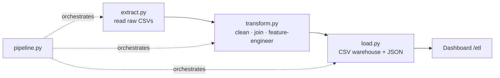
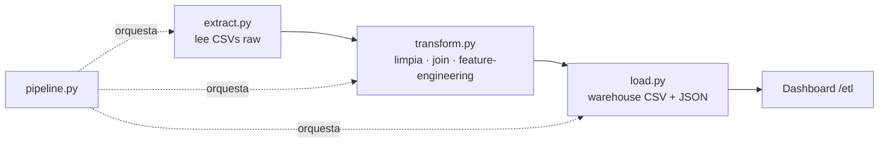

# Sales & Weather ETL — Data Engineering Pipeline

> **Data Engineering portfolio project** · Python · Pandas · modular ETL
> **Status:** Finished · Live on portfolio
> A reproducible Extract–Transform–Load pipeline that joins two independent real-world datasets — retail sales and daily city temperatures — to answer a concrete business question: *does the weather move sales?*

> 🇬🇧 **English version first.** · 🇪🇸 **La versión en español está más abajo** → [ir a Español](#-español).

[](https://proyectos-mindset-code.web.app/etl)
[](https://mindset-code.com/es/codigo)
[](.)
[](.)
[](LICENSE)

---

## The problem this solves

Real insight rarely lives in one table — it lives in the **join** between sources that were never designed to be combined. This project takes two independent public datasets and engineers a clean, reproducible pipeline that merges them by city and date, so a business can ask: *do temperature swings correlate with what people buy?*

It demonstrates the core of **Data Engineering**: a modular Extract → Transform → Load architecture with logging and traceability, turning ~2.9M raw weather records and ~9,800 sales transactions into six pre-aggregated, dashboard-ready datasets.

**▶ Live dashboard: [proyectos-mindset-code.web.app/etl](https://proyectos-mindset-code.web.app/etl)**

---

## Data sources

| Source | Dataset | Volume |
|--------|---------|--------|
| Sales | Superstore Sales (Kaggle) | ~9,800 transactions |
| Weather | Daily Temperature of Major Cities (Kaggle) | ~2.9M records |

Joined on **city + date** — two systems that never knew about each other, unified.

---

## Architecture — modular ETL



| Stage | Module | Responsibility |
|-------|--------|----------------|
| **Extract** | `src/extract.py` | Read raw CSVs with explicit dtypes + row-count logging |
| **Transform** | `src/transform.py` | Clean nulls/types, aggregate weather to city-day, °F→°C, **join sales × weather**, bucket temperatures (Cold/Mild/Warm/Hot) |
| **Load** | `src/load.py` | Write CSV warehouse + 6 pre-aggregated JSONs |
| **Orchestrate** | `src/pipeline.py` | Run E→T→L with logging |

A **Node.js fallback** (`generate_json.mjs`) reproduces the same outputs where Pandas isn't available.

---

## Output datasets

| File | Description |
|------|-------------|
| `sales_by_category.json` | Revenue by product category |
| `monthly_revenue.json` | Revenue by month |
| `sales_by_temp.json` | Revenue by temperature bucket |
| `sales_by_region.json` | Revenue by US region |
| `sales_weekend_vs_weekday.json` | Weekend vs weekday |
| `temp_vs_sales_scatter.json` | Temperature × sales (500-point sample) |

---

## Tech stack

| Layer | Technology |
|-------|-----------|
| ETL | Python 3.12 · Pandas · NumPy |
| Fallback | Node.js (ES Modules) |
| Visualization | React · Recharts (in `project-portfolio`) |
| Domain | Data Engineering · ETL · feature engineering |

---

## Getting started

```bash
git clone https://github.com/mindset-code/project-sales-weather-etl.git
cd project-sales-weather-etl
python -m venv .venv && source .venv/bin/activate
pip install -r requirements.txt

python etl_pipeline.py      # Extract → Transform → Load
# or, without Pandas:
node generate_json.mjs
```

> Raw datasets are not versioned — download the two Kaggle datasets into `data/raw/` first.

---

## Repository structure

```
project-sales-weather-etl/
├── etl_pipeline.py        # entry point
├── generate_json.mjs      # Node.js fallback
├── requirements.txt
├── src/
│   ├── extract.py         # read raw CSVs
│   ├── transform.py       # clean · join · feature-engineer
│   ├── load.py            # CSV warehouse + JSON
│   └── pipeline.py        # E→T→L orchestrator
├── data/raw/              # source datasets (not versioned)
├── LICENSE                # MIT
└── README.md
```

---

## License & contact

Released under the **[MIT License](LICENSE)**.

- **Live:** [proyectos-mindset-code.web.app/etl](https://proyectos-mindset-code.web.app/etl)
- **Web:** [mindset-code.com](https://mindset-code.com/es)
- **Email:** contacto@mindset-code.com

---

# 🇪🇸 Español

# Sales & Weather ETL — Pipeline de Data Engineering

> **Proyecto de portafolio de Data Engineering** · Python · Pandas · ETL modular
> **Estado:** Terminado · Publicado en el portafolio
> Un pipeline Extract–Transform–Load reproducible que une dos datasets reales independientes —ventas retail y temperaturas diarias de ciudades— para responder una pregunta concreta de negocio: *¿el clima mueve las ventas?*

> 🇪🇸 Traducción al español. La versión en inglés está al inicio → [ir a English](#sales--weather-etl--data-engineering-pipeline).

---

## El problema que resuelve

El insight real rara vez vive en una sola tabla — vive en el **join** entre fuentes que nunca se diseñaron para combinarse. Este proyecto toma dos datasets públicos independientes y construye un pipeline limpio y reproducible que los une por ciudad y fecha, para que un negocio pueda preguntar: *¿las variaciones de temperatura se correlacionan con lo que compra la gente?*

Demuestra el núcleo del **Data Engineering**: una arquitectura modular Extract → Transform → Load con logging y trazabilidad, que convierte ~2,9M de registros de clima y ~9.800 transacciones de ventas en seis datasets pre-agregados listos para dashboard.

**▶ Dashboard en vivo: [proyectos-mindset-code.web.app/etl](https://proyectos-mindset-code.web.app/etl)**

---

## Fuentes de datos

| Fuente | Dataset | Volumen |
|--------|---------|---------|
| Ventas | Superstore Sales (Kaggle) | ~9.800 transacciones |
| Clima | Daily Temperature of Major Cities (Kaggle) | ~2,9M registros |

Unidos por **ciudad + fecha** — dos sistemas que nunca supieron el uno del otro, unificados.

---

## Arquitectura — ETL modular



| Etapa | Módulo | Responsabilidad |
|-------|--------|-----------------|
| **Extract** | `src/extract.py` | Lee CSVs raw con dtypes explícitos + logging de filas |
| **Transform** | `src/transform.py` | Limpia nulls/tipos, agrega clima a city-day, °F→°C, **join ventas × clima**, buckets de temperatura (Cold/Mild/Warm/Hot) |
| **Load** | `src/load.py` | Escribe warehouse CSV + 6 JSONs pre-agregados |
| **Orquestar** | `src/pipeline.py` | Ejecuta E→T→L con logging |

Un **fallback en Node.js** (`generate_json.mjs`) reproduce las mismas salidas donde no hay Pandas.

---

## Datasets de salida

| Archivo | Descripción |
|---------|-------------|
| `sales_by_category.json` | Revenue por categoría de producto |
| `monthly_revenue.json` | Revenue por mes |
| `sales_by_temp.json` | Revenue por bucket de temperatura |
| `sales_by_region.json` | Revenue por región US |
| `sales_weekend_vs_weekday.json` | Fin de semana vs entre semana |
| `temp_vs_sales_scatter.json` | Temperatura × ventas (muestra de 500 puntos) |

---

## Stack técnico

| Capa | Tecnología |
|------|-----------|
| ETL | Python 3.12 · Pandas · NumPy |
| Fallback | Node.js (ES Modules) |
| Visualización | React · Recharts (en `project-portfolio`) |
| Dominio | Data Engineering · ETL · feature engineering |

---

## Cómo empezar

```bash
git clone https://github.com/mindset-code/project-sales-weather-etl.git
cd project-sales-weather-etl
python -m venv .venv && source .venv/bin/activate
pip install -r requirements.txt

python etl_pipeline.py      # Extract → Transform → Load
# o, sin Pandas:
node generate_json.mjs
```

> Los datasets raw no se versionan — descarga los dos datasets de Kaggle en `data/raw/` primero.

---

## Estructura del repositorio

```
project-sales-weather-etl/
├── etl_pipeline.py        # entry point
├── generate_json.mjs      # fallback Node.js
├── requirements.txt
├── src/
│   ├── extract.py         # lee CSVs raw
│   ├── transform.py       # limpia · join · feature-engineering
│   ├── load.py            # warehouse CSV + JSON
│   └── pipeline.py        # orquestador E→T→L
├── data/raw/              # datasets fuente (no versionados)
├── LICENSE                # MIT
└── README.md
```

---

## Licencia y contacto

Publicado bajo la **[Licencia MIT](LICENSE)**.

- **En vivo:** [proyectos-mindset-code.web.app/etl](https://proyectos-mindset-code.web.app/etl)
- **Web:** [mindset-code.com](https://mindset-code.com/es)
- **Email:** contacto@mindset-code.com

---

*Mindset & Code · asesoría fiscal y tecnológica · [mindset-code.com](https://mindset-code.com/es)*
